# 《回归模型与方差分析》2026 · Assignment 1 完全解答

**说明**：本解答包含每题完整的推导（题 1–4）与数据分析结果（题 5–8）。
所有数值结果与图都可由本目录下的代码一键复现：

```
bash code/run_all.sh          # 依次运行 6 个脚本
```

数据文件在 `data/`，生成的表格在 `results/`，图像在 `figures/`。
模拟与数值校核（恒等式检查、Monte Carlo、全子集穷举）在 `code/p1_p4_verify.py`
和 `code/p8_student.py` 中，用于确认代数推导的每一条结论。

## 答案速览

| 题号 | 结论 | 关键数值 |
| --- | --- | --- |
| 1 | $\sum_i \hat y_i/n=\bar y$；$SS_{reg}=\sum_i(\hat y_i-\bar y)^2=\hat\beta_1^2S_{xx}$；$R^2=r_{XY}^2$ | 数值残差 $\leq 10^{-12}$ |
| 2 | 两者都无偏；$\text{Var}(\hat\beta)\leq \text{Var}(\tilde\beta)$，等号仅当所有 $x_i$ 相同 | 方差比 $0.9449=n\bar x^2/\sum x_i^2$ |
| 3 | $\tilde\beta_1=(X_1^{\top}X_1)^{-1}X_1^{\top}Y$；无偏 $\Longleftrightarrow X_1^{\top}X_2=0$ | 有偏 $0.650$，正交 $9\times10^{-17}$ |
| 4 | $\hat b=(Z^{\top}Z)^{-1}Z^{\top}Y$，前 $p+1$ 个分量无偏 $\mathbb{E}[\tilde\beta]=\beta^{*}$ | 偏差 $\leq 0.007$，方差膨胀至 $2.85$ 倍 |
| 5 | 三种样条明显优于三次多项式；自然样条（$K=10$）与三次样条（$K=7$）最好 | LOOCV $2.851\times10^6$ vs $2.957\times10^6$ |
| 6 | 前三个主成分累计解释 $72.5\%$ 的方差；$gdp$ 回归 $R^2=0.6908$ | $F=13.40,\ p=7.7\times10^{-5}$ |
| 7 | $R^2_{adj}$ 选 $Y\sim A+B+C$；AIC、BIC 选只有截距的 $Y\sim 1$ | 嵌套 $F$ 检验均不显著（$p\geq 0.20$） |
| 8 | FS / BE / FS+BE 在 AIC 与 BIC 下都选中全部 5 个自变量 | $R^2=0.9888$，与全子集穷举最优一致 |

---

# Problem 1 (15 pts)

设 $\hat\beta_0,\hat\beta_1$ 为简单线性回归 $y_i=\beta_0+\beta_1x_i+e_i$ 的最小二乘估计，
$\hat y_i=\hat\beta_0+\hat\beta_1x_i$，并记
$\bar x=\frac{1}{n}\sum_ix_i$、$\bar y=\frac{1}{n}\sum_iy_i$，
$S_{xx}=\sum_i(x_i-\bar x)^2$、$S_{xy}=\sum_i(x_i-\bar x)(y_i-\bar y)$、$S_{yy}=\sum_i(y_i-\bar y)^2$。

最小二乘的正规方程（normal equations）为

$$
\sum_{i=1}^{n}(y_i-\hat y_i)=0,\qquad \sum_{i=1}^{n}x_i(y_i-\hat y_i)=0 .
$$

记残差 $e_i=y_i-\hat y_i$，即 $\sum_ie_i=0,\ \sum_ix_ie_i=0$。这两个等式是所有结论的来源。

## (1) $\frac{1}{n}\sum_{i=1}^n\hat y_i=\bar y$

由正规方程第一式 $\sum_ie_i=0$，

$$
\sum_{i=1}^{n}\hat y_i=\sum_{i=1}^{n}(y_i-e_i)=\sum_{i=1}^{n}y_i-\sum_{i=1}^{n}e_i=\sum_{i=1}^{n}y_i,
$$

两边除以 $n$ 即得 $\frac{1}{n}\sum_i\hat y_i=\bar y$。也就是说：**回归直线必过样本重心 $(\bar x,\bar y)$**
（等价地 $\hat\beta_0=\bar y-\hat\beta_1\bar x$，这与 $\hat\beta_1=S_{xy}/S_{xx}$ 的公式一致）。
值得注意的是，结论只需要 $\sum_ie_i=0$，不需要任何分布假设。

## (2) $SS_{reg}=\sum_{i=1}^{n}(\hat y_i-\bar y)^2$

这里 $SS_{reg}$（回归平方和）按定义就是 $\sum_i(\hat y_i-\bar y)^2$。为完整起见，我们证明若干等价的常用表达式，
以及相应的平方和分解。

**引理（平方和分解）**：$S_{yy}=\sum_i(\hat y_i-\bar y)^2+\sum_i(y_i-\hat y_i)^2$。

证明：先展开

$$
\sum_i(y_i-\bar y)^2=\sum_i\left[(y_i-\hat y_i)+(\hat y_i-\bar y)\right]^2
=\sum_ie_i^2+2\sum_ie_i(\hat y_i-\bar y)+\sum_i(\hat y_i-\bar y)^2 .
$$

交叉项为零，因为 $\hat y_i-\bar y=\hat\beta_0+\hat\beta_1x_i-(\hat\beta_0+\hat\beta_1\bar x)=\hat\beta_1(x_i-\bar x)$，于是
由正规方程

$$
\sum_ie_i(\hat y_i-\bar y)=\hat\beta_1\left[\sum_ix_ie_i-\bar x\sum_ie_i\right]=0 .
$$

故 $S_{yy}=SSE+SS_{reg}$，其中 $SSE=\sum_ie_i^2$。$\blacksquare$

再由 $\hat y_i-\bar y=\hat\beta_1(x_i-\bar x)$ 立得

$$
SS_{reg}=\sum_{i=1}^{n}(\hat y_i-\bar y)^2=\hat\beta_1^{2}\sum_{i=1}^{n}(x_i-\bar x)^2=\hat\beta_1^{2}S_{xx}
=\frac{S_{xy}^{2}}{S_{xx}} .
$$

又由 (1) 有 $\sum_i\hat y_i=n\bar y$，所以

$$
SS_{reg}=\sum_i\hat y_i^{2}-2\bar y\sum_i\hat y_i+n\bar y^{2}=\sum_i\hat y_i^{2}-n\bar y^{2}.
$$

综上：

$$
SS_{reg}=\sum_{i=1}^{n}(\hat y_i-\bar y)^2=\hat\beta_1^{2}S_{xx}=\frac{S_{xy}^{2}}{S_{xx}}=\sum_{i=1}^{n}\hat y_i^{2}-n\bar y^{2},\qquad
S_{yy}=SS_{reg}+SSE .
$$

## (3) $R^{2}=r_{XY}^{2}$

按定义 $R^{2}=SS_{reg}/S_{yy}$（一般模型的 $R^2=1-SSE/SST$，在这里 $SST=S_{yy}$，由 (2) 两者一致）。把上面的表达式代入：

$$
R^{2}=\frac{SS_{reg}}{S_{yy}}
=\frac{S_{xy}^{2}/S_{xx}}{S_{yy}}
=\frac{S_{xy}^{2}}{S_{xx}S_{yy}}
=r_{XY}^{2},
$$

其中 $r_{XY}$ 是 $X$ 与 $Y$ 的样本相关系数。由 Cauchy–Schwarz 不等式
$S_{xy}^{2}\leq S_{xx}S_{yy}$ 立刻得到 $0\leq R^{2}\leq 1$，
并且 $R^2=1$ 当且仅当所有点共线（$e_i\equiv 0$）。

**数值复核**（`code/p1_p4_verify.py`，$n=37$）：三条恒等式的数值残差分别为
$|\frac{1}{n}\sum\hat y_i-\bar y|=3.6\times10^{-15}$、
$|SS_{reg}-\hat\beta_1^2S_{xx}|=3.4\times10^{-13}$、
$|R^{2}-r_{XY}^{2}|=4.4\times10^{-16}$、
$|S_{yy}-SS_{reg}-SSE|=3.8\times10^{-13}$，
与理论完全一致。

---

# Problem 2 (10 pts)

模型 $y_i=\beta^{*}x_i+e_i$，$e_i$ 独立同分布 $N(0,\sigma_*^{2})$，**不含截距**。

## (1) 两个估计量都无偏

在无截距模型下最小二乘问题为 $\min_\beta\sum_i(y_i-\beta x_i)^2$，其驻点满足
$\sum_ix_i(y_i-\beta x_i)=0$，即

$$
\hat\beta=\frac{\sum_ix_iy_i}{\sum_ix_i^{2}} .
$$

（假设 $\sum_ix_i^2>0$。）由 $\mathbb{E}[y_i]=\beta^{*}x_i$，

$$
\mathbb{E}[\hat\beta]=\frac{\sum_ix_i\mathbb{E}[y_i]}{\sum_ix_i^{2}}
=\beta^{*}\frac{\sum_ix_i^{2}}{\sum_ix_i^{2}}=\beta^{*}.
$$

另一个估计量 $\tilde\beta=\bar y/\bar x$（假设 $\bar x\neq 0$）满足

$$
\mathbb{E}[\tilde\beta]=\frac{\mathbb{E}[\bar y]}{\bar x}=\frac{\beta^{*}\bar x}{\bar x}=\beta^{*}.
$$

故两者都是 $\beta^{*}$ 的无偏估计。注意：无偏性只用到 $\mathbb{E}[e_i]=0$，不需要正态性
（正态性只在做区间估计、检验或比较分布时才会用到）。

## (2) 方差比较：$\hat\beta$ 的方差更小

由 $e_i$ 独立、$\text{Var}(e_i)=\sigma_*^{2}$：

$$
\text{Var}(\hat\beta)=\frac{\sum_ix_i^{2}\text{Var}(y_i)}{(\sum_ix_i^{2})^{2}}
=\frac{\sigma_*^{2}}{\sum_ix_i^{2}},
\qquad
\text{Var}(\tilde\beta)=\frac{\text{Var}(\bar y)}{\bar x^{2}}
=\frac{n\sigma_*^{2}/n^{2}}{\bar x^{2}}=\frac{\sigma_*^{2}}{n\bar x^{2}} .
$$

关键恒等式是平方和分解

$$
\sum_{i=1}^{n}x_i^{2}=n\bar x^{2}+\sum_{i=1}^{n}(x_i-\bar x)^{2}\ \geq\ n\bar x^{2},
$$

等号成立当且仅当 $x_1=\cdots=x_n=\bar x$。于是

$$
\text{Var}(\hat\beta)=\frac{\sigma_*^{2}}{\sum_ix_i^{2}}\ \leq\ \frac{\sigma_*^{2}}{n\bar x^{2}}=\text{Var}(\tilde\beta),
\qquad
\frac{\text{Var}(\tilde\beta)}{\text{Var}(\hat\beta)}=\frac{\sum_ix_i^{2}}{n\bar x^{2}}=1+\frac{\sum_i(x_i-\bar x)^2}{n\bar x^{2}}\ \geq\ 1 .
$$

**结论**：除非所有 $x_i$ 完全相同（此时 $S_{xx}=0$、两估计量重合），$\hat\beta$ 的方差严格小于 $\tilde\beta$ 的方差，
因此 $\hat\beta$ 更优（事实上它是该无截距模型下的 BLUE，也是 $\beta$ 的极大似然估计）。
直观上，$\tilde\beta$ 只用到了 $y$ 的均值而完全丢弃了 $x_i$ 与 $y_i$ 的配对信息，
只要 $x$ 有波动（$S_{xx}>0$）就浪费了信息；比值 $1+S_{xx}/(n\bar x^{2})$ 也说明
$x$ 的相对波动越大，$\hat\beta$ 的优势越明显。

**数值复核**（$n=12$，$\beta^{*}=2$，$10^5$ 次模拟）：$\mathbb{E}[\hat\beta]=1.99985$、
$\mathbb{E}[\tilde\beta]=1.99986$（均与 $2$ 无显著差异）；理论方差
$\text{Var}(\hat\beta)=\sigma^2/\sum_ix_i^2=0.005885$，$\text{Var}(\tilde\beta)=\sigma^2/(n\bar x^2)=0.006228$，
模拟值 $0.005914$ 与 $0.006257$ 与之吻合；方差比 $0.9449$ 与 $n\bar x^{2}/\sum x_i^{2}$ 精确一致。

---

# Problem 3 (10 pts)：欠拟合与遗漏变量偏差

真实模型 $Y=X\beta^{*}+e=X_1\beta_1^{*}+X_2\beta_2^{*}+e$，但我们只把前 $p_1$ 列 $X_1$ 放进回归。

## (1) 遗漏变量模型的估计量

最小二乘问题 $\min_{\beta_1}\|Y-X_1\beta_1\|^{2}$ 的正规方程为 $X_1^{\top}X_1\beta_1=X_1^{\top}Y$，
当 $X_1$ 列满秩（$\text{rank}(X_1)=p_1$，即 $X_1^{\top}X_1$ 可逆）时

$$
\tilde\beta_1=(X_1^{\top}X_1)^{-1}X_1^{\top}Y .
$$

## (2) 无偏 $\Longleftrightarrow X_1^{\top}X_2=0$

把真实模型代入上式并取期望（$\mathbb{E}[e]=0$，$X$ 非随机）：

$$
\mathbb{E}[\tilde\beta_1]=(X_1^{\top}X_1)^{-1}X_1^{\top}\left(X_1\beta_1^{*}+X_2\beta_2^{*}\right)
=\beta_1^{*}+A\beta_2^{*},\qquad A:=(X_1^{\top}X_1)^{-1}X_1^{\top}X_2 .
$$

**充分性**：若 $X_1^{\top}X_2=0$ 则 $A=0$，于是 $\mathbb{E}[\tilde\beta_1]=\beta_1^{*}$。

**必要性**：若 $\tilde\beta_1$ 是 $\beta_1^{*}$ 的无偏估计（即对任意真参数 $\beta^{*}$、特别对任意 $\beta_2^{*}$ 都有
$\mathbb{E}[\tilde\beta_1]=\beta_1^{*}$），则必须 $A\beta_2^{*}=0$ 对一切 $\beta_2^{*}\in\mathbb{R}^{p_2}$ 成立，
即 $A=0$。再用 $X_1^{\top}X_1$ 可逆：$A=(X_1^{\top}X_1)^{-1}X_1^{\top}X_2=0
\Longleftrightarrow X_1^{\top}X_2=0$。$\blacksquare$

**注记（本题最重要的两点）**

1. $A\beta_2^{*}$ 就是经典的遗漏变量偏差（omitted-variable bias）。它为零的两种情形是：
   $X_1^{\top}X_2=0$（新老变量正交），或者被漏掉的系数恰好为 $0$（$\beta_2^{*}=0$，即“漏掉”的其实是无关变量）。
2. 由于 $X_1$ 的第一列是全为 1 的常数列，$X_1^{\top}X_2=0$ 还要求 $X_2$ 的**每一列样本均值为 0**
   （因为 $X_1^{\top}X_2$ 的第一行是 $\mathbf{1}^{\top}X_2$）。所以只要漏掉的变量在样本中均值非零，
   截距项就会“吸收”它们的一部分影响，估计量就有偏。

**数值复核**：取 $n=60$，$X_1=[\mathbf{1},x]$，$X_2$ 为两个随机变量，$\beta_2^{*}=(3,-1.5)$。
一般情形下偏差 $A\beta_2^{*}$ 的最大分量为 $0.650$（而 $\max|X_1^{\top}X_2|=12.87$）；
构造与 $X_1$ 正交的 $X_2$ 后偏差为 $8.8\times10^{-17}$，与理论相符。

---

# Problem 4 (10 pts)：过拟合与无关变量

真实模型 $Y=X\beta^{*}+e$，我们额外加入 $q$ 列 $X'$，令 $Z=[X\ X']$，
并把真系数补零写成 $b^{*}=(\beta^{*\top},0,\dots,0)^{\top}$，于是同样有 $Y=Zb^{*}+e$。

## (1) 过拟合模型的估计量

$\min_b\|Y-Zb\|^{2}$ 的正规方程为 $Z^{\top}Zb=Z^{\top}Y$，若 $Z$ 列满秩则

$$
\hat b=(Z^{\top}Z)^{-1}Z^{\top}Y .
$$

## (2) 前 $p+1$ 个分量无偏

$$
\mathbb{E}[\hat b]=(Z^{\top}Z)^{-1}Z^{\top}\mathbb{E}[Y]=(Z^{\top}Z)^{-1}Z^{\top}Zb^{*}=b^{*}
=\binom{\beta^{*}}{0} .
$$

取前 $p+1$ 个分量即得 $\mathbb{E}[\tilde\beta]=\beta^{*}$。**结论**：加入了无关变量后，参数估计仍然无偏
（同时附加的 $q$ 个系数也以 0 为无偏目标）。$\blacksquare$

**注记：无偏的代价是方差膨胀。** 写

$$
Z^{\top}Z=\binom{A_{11}\ \ A_{12}}{A_{21}\ \ A_{22}},\qquad
A_{11}=X^{\top}X,\quad A_{12}=X^{\top}X'=A_{21}^{\top},\quad A_{22}=X'^{\top}X',
$$

利用分块矩阵求逆公式，$\text{Cov}(\hat b)=\sigma^{2}(Z^{\top}Z)^{-1}$ 的左上 $(p+1)\times(p+1)$ 块是

$$
\text{Cov}(\tilde\beta)=\sigma^{2}\left[(X^{\top}X)^{-1}
+(X^{\top}X)^{-1}X^{\top}X'\left[X'^{\top}(I-P_X)X'\right]^{-1}X'^{\top}X(X^{\top}X)^{-1}\right],
$$

其中 $P_X=X(X^{\top}X)^{-1}X^{\top}$。第二项是半正定的，因此

$$
\text{Cov}(\tilde\beta)\ \succeq\ \sigma^{2}(X^{\top}X)^{-1}=\text{Cov}(\hat\beta_{\mathrm{true}}),
$$

等号成立当且仅当 $X^{\top}X'=0$（无关变量与原有变量样本正交）。单变量的形式就是我们熟悉的方差膨胀因子：

$$
\text{Var}(\tilde\beta_j)=\frac{\sigma^{2}}{(n-1)s_{x_j}^{2}}\cdot \text{VIF}_j,\qquad
\text{VIF}_j=\frac{1}{1-R_j^{2}},
$$

其中 $R_j^{2}$ 是第 $j$ 个自变量对其余所有自变量（含无关变量）回归的 $R^{2}$。

**数值复核**（$n=80$，$p=3$，$q=2$，$4000$ 次模拟）：

| 情形 | 真实系数偏差 | 方差膨胀倍数（MC） |
| --- | --- | --- |
| 无关变量与 $X$ 独立 | $0.0034$ | $1.006$ |
| 无关变量与 $X$ 强相关（$\text{VIF}=3.57,2.71$） | $0.0066$ | $2.81,\ 2.71$ |

两点观察与理论一致：(i) 两种情形下前 $p+1$ 个系数的模拟均值都接近真值（无偏）；
(ii) 当无关变量与原有变量几乎正交时几乎不产生方差膨胀，而在强相关时方差可以膨胀近 3 倍。

**补充**：加入无关变量也不改变拟合值的期望（$P_ZX=X$，故 $\mathbb{E}[\hat y]=X\beta^{*}$ 与真模型相同），
但拟合值的方差同样增大：模拟中 $\text{Var}(\hat y_{\mathrm{overfit}})/\text{Var}(\hat y_{\mathrm{true}})$
的最大值达到 $6.6$（对应杠杆最大的样本点）。这正是“过拟合”的量化表现：
无偏不等于更准，MSE 会更差（$\text{MSE}=\text{bias}^2+\text{variance}$，偏差为 0 而方差变大）。

---

# Problem 5 (20 pts)：用电量的四种曲线拟合

## 5.1 数据与模型设定

`powerconsumption.csv` 记录 2017 年摩洛哥三个地区每天的用电量（$n=364$，2017-01-01 至 2017-12-30）。
我们取 $Y=$ `PowerConsumption_Zone1`（当日各区用电量），$x=$ `Temperature`（当日温度，$^\circ$C）。
数据范围：$x\in[8.63,32.43]$，$Y\in[26772,38733]$。四个模型均为线性参数模型，
可以统一写成 $Y=\Psi(x)^{\top}\theta+\varepsilon$ 并用最小二乘拟合：

**(a) 三次多项式**：$\Psi(x)=(1,x,x^{2},x^{3})^{\top}$，参数个数 $4$。

**(b) 三次样条**（以 $\xi_1<\cdots<\xi_K$ 为结点，截断幂基）：$\Psi(x)=(1,x,x^{2},x^{3},(x-\xi_1)_+^{3},\dots,(x-\xi_K)_+^{3})^{\top}$，
参数个数 $K+4$。

**(c) 自然三次样条**（$K$ 个结点的 $K$ 维基，见 Hastie 等《统计学习基础》§5.2.1）：

$$
\Psi(x)=\left(1,\ x,\ d_1(x),\dots,d_{K-2}(x)\right)^{\top},\qquad
d_j(x)=\frac{(x-\xi_j)_+^{3}-(x-\xi_K)_+^{3}}{\xi_K-\xi_j},
$$

参数个数 $K$；它在边界外是线性的（二阶导数在 $\xi_1,\xi_K$ 外为零），比普通三次样条更稳定。

**(d) 平滑样条**：以全部观测点为结点的自然三次平滑样条，极小化

$$
\sum_i\left(y_i-f(x_i)\right)^2+\lambda\int f''(t)^{2}\,dt .
$$

对结点集 $N$（$N_{ij}=d_j(x_i)$）记 $\Omega_{jk}=\int d_j''(t)d_k''(t)\,dt$（用 Gauss–Legendre 分段精确积分），
则 $\hat f=\sum_j\hat\theta_jd_j$，$\hat\theta=(N^{\top}N+\lambda\Omega)^{-1}N^{\top}y$，
光滑参数 $\lambda$ 由广义交叉验证（GCV）选取，自由度 $\text{edf}=\text{tr}\left[N(N^{\top}N+\lambda\Omega)^{-1}N^{\top}\right]$。

**结点选择**：三次样条与自然样条的结点个数 $K$ 用留一交叉验证（LOOCV）在 $K=2,\dots,14$ 上选取，
并同时报告 AIC/BIC 的选择作为稳健性对照（$K=2$ 时三次样条退化为三次多项式）。
在等距分位点结点下，$K$ 越大模型越灵活，RSS 单调下降但方差上升，故需要用准则权衡。

## 5.2 结果

结点选择：三次样条 LOOCV 选 $K=7$（AIC 也选 7，BIC 选 2）；自然样条 LOOCV 与 AIC 都选 $K=10$
（BIC 选 4）；平滑样条由 GCV 选出 $\lambda=21.14$，对应 $\text{edf}=8.35$。
把各准则选出的模型一并列出（k 为有效参数个数）：

| 模型 | k | RSS | R² | R²adj | AIC | BIC | LOOCV |
| --- | --- | --- | --- | --- | --- | --- | --- |
| 自然三次样条 K=10 | 10 | 9.8676e+08 | 0.6185 | 0.6088 | 5411.85 | 5450.82 | 2.8513e+06 |
| 三次样条 K=7 | 11 | 9.8613e+08 | 0.6187 | 0.6079 | 5413.62 | 5456.49 | 2.8573e+06 |
| 平滑样条 (edf=8.35) | 8.35 | 9.9645e+08 | 0.6148 | 0.6068 | 5412.10 | 5444.63 | 2.8654e+06 |
| 自然样条 K=4（BIC 选择） | 4 | 1.0290e+09 | 0.6022 | 0.5989 | 5415.11 | 5430.70 | 2.8851e+06 |
| 三次样条 K=2（BIC 选择） | 6 | 1.0190e+09 | 0.6060 | 0.6005 | 5415.55 | 5438.93 | 2.9081e+06 |
| 三次多项式 | 4 | 1.0528e+09 | 0.5930 | 0.5896 | 5423.45 | 5439.03 | 2.9565e+06 |

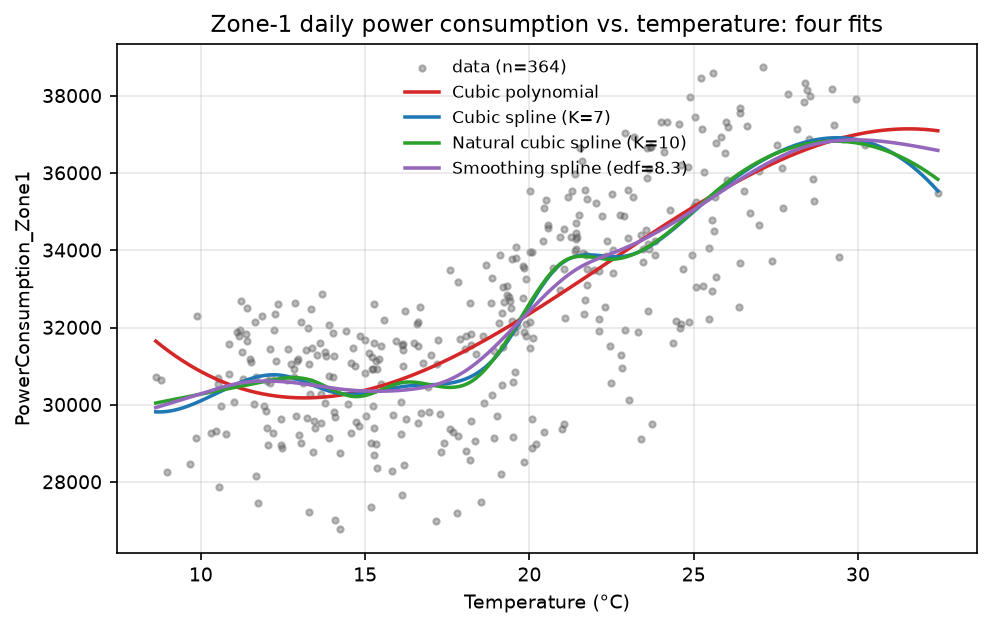

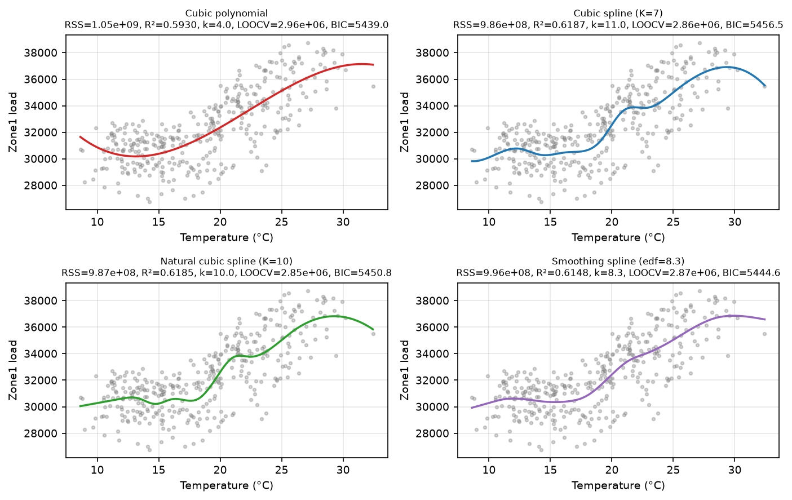

## 5.3 讨论

1. **排序**：按 LOOCV（预测误差）与 AIC，自然三次样条（$K=10$）最好，三次样条（$K=7$）紧随其后，
   平滑样条（$\text{edf}=8.35$）与它们几乎等价（差别在 $0.5\%$ 以内），三次多项式最差：
   其 RSS 比最好的样条高约 $6.7\%$，LOOCV 高约 $3.7\%$。也就是说，仅用 4 个参数的全局三次多项式
   无法刻画这条曲线在 $12$–$15^\circ$C 与 $20$–$24^\circ$C 附近的局部凹凸。
2. **为什么平滑样条也很好**：GCV 自动选择 $\text{edf}\approx8.35$，与“用 LOOCV 选结点”的自由度相当，
   说明数据支持的“有效复杂度”大约就是 8–10 个参数；进一步增加结点（$K>10$）只会增大方差
   （见 `p5_knot_selection.csv`：$K=14$ 时 RSS 更小但 LOOCV/AIC 变差）。
3. **BIC 更保守**：BIC 的惩罚 $k\log n$ 较重（$\log 364\approx5.9$），倾向选 $K=4$（自然样条）或 $K=2$；
   但它们的 LOOCV 明显更差。做预测时用 LOOCV/AIC 的复杂度更合适。
4. **曲线形状（对“温度对用电量的影响”的回答）**：四种模型都给出 **U 形（下凸）** 关系：
   温度过低（$<15^\circ$C）或过高（$>25^\circ$C）时用电量最高，$25$–$30^\circ$C 附近出现峰值 $\approx3.7\times10^{4}$。
   二次型的拟合曲线在左端的极小值出现在约 $13^\circ$C（三次多项式）或数据左端点 $8.6^\circ$C（样条），
   说明数据范围内用电量最低的区间大致是 $15$–$20^\circ$C；把最低点位置解释为“最舒适、耗电最少”的温度时要注意，
   样条给出的最小值落在数据边界附近，外推能力有限。
5. **残差诊断**：所有模型的 Durbin–Watson 统计量都在 $0.68$–$0.77$ 之间，远小于 2，
   说明残差存在很强的正自相关（这是时间序列数据的典型现象：相邻日期的用电量受天气、节假日等共同因素影响）。
   因此：模型之间的比较（相同数据集、相同自相关结构）仍然有意义，但基于 i.i.d. 假设的
   标准误、置信区间和 AIC 惩罚都偏乐观，不宜过度解读小到 $0.5\%$ 的差异。
   若要认真建模，应该加入时间结构（AR 误差、季节哑变量等），这已超出本题范围。

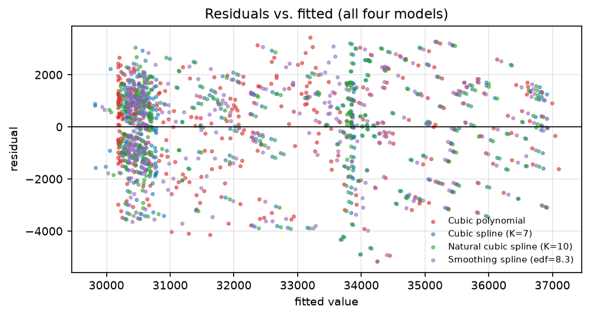

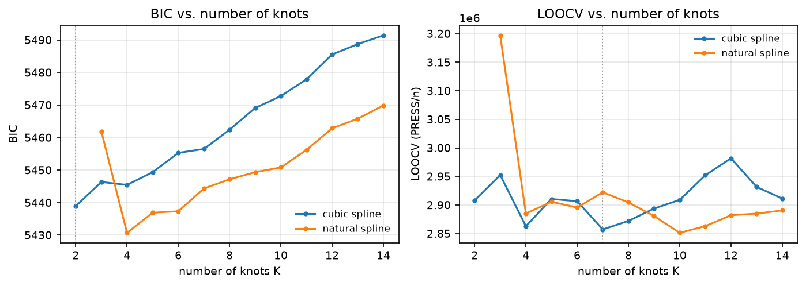

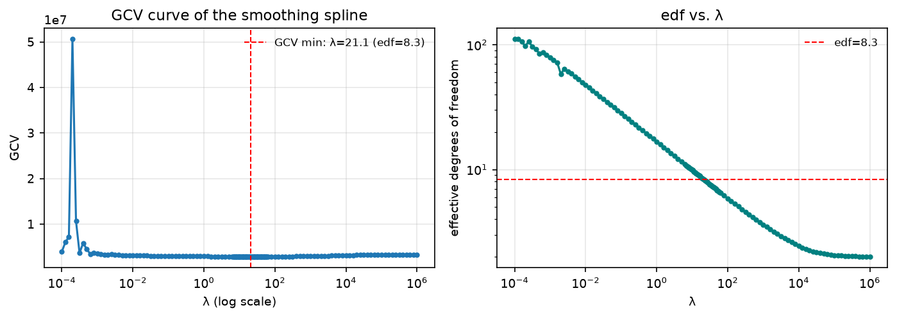

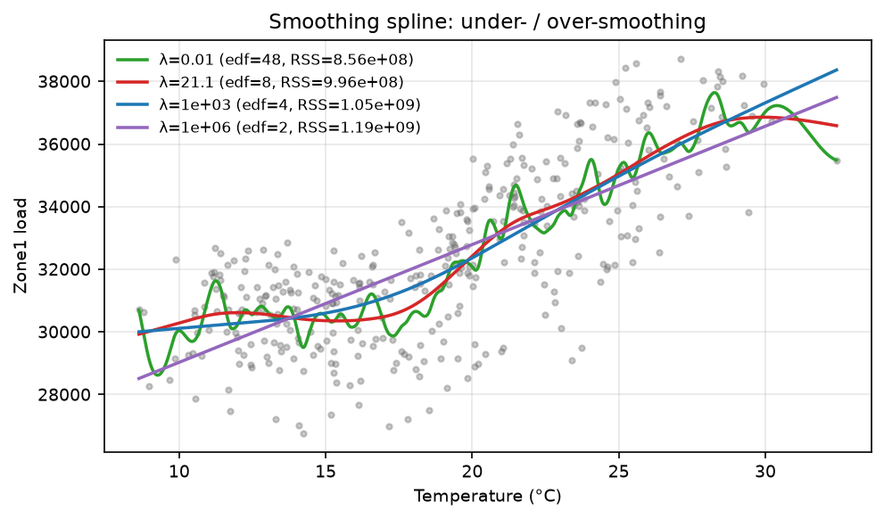

**实现校核**：自编的平滑样条与 `scipy.interpolate.make_smoothing_spline`（同一 GCV 准则）的
RSS 分别为 $9.9645\times10^{8}$ 与 $9.9673\times10^{8}$（相差 $0.03\%$），两者一致。

---

# Problem 6 (10 pts)：阿根廷各省经济指标的 PCA 回归

## 6.1 数据与标准化

`argentina.csv` 为 22 个省份的 10 个经济/社会指标。取 $Y=$ `gdp`，
自变量为其余 9 个变量：`illiteracy, poverty, deficient_infra, school_dropout, no_healthcare,
birth_mortal, pop, movie_theatres_per_cap, doctors_per_cap`。

这些变量量纲差异极大（`gdp` 量级 $10^{7}$，`movie_theatres_per_cap` 量级 $10^{-6}$）。
若直接对原始变量做 PCA，方差完全由量纲最大的变量主导：第一主成分就解释了 $99.999999998\%$ 的方差
（见 `results/p6_pca_variance`），得到的主成分没有统计意义。因此必须**先标准化**（每个变量减均值、除标准差），
即在相关矩阵上做 PCA。下文结果均指标准化后的 PCA。

## 6.2 前三个主成分及其解释的方差比例

| 主成分 | 特征值 | 方差解释比例 | 累计比例 |
| --- | --- | --- | --- |
| PC1 | 4.545 | 0.4821 | 0.4821 |
| PC2 | 1.237 | 0.1312 | 0.6133 |
| PC3 | 1.053 | 0.1117 | 0.7250 |
| PC4 | 0.918 | 0.0974 | 0.8223 |

前三个主成分累计解释 **72.5%** 的方差。（特征值之和为 $p\cdot n/(n-1)=9\times22/21=9.4286$，
与非零特征值总和的检验一致；用 `numpy.linalg.eigvalsh` 独立计算相关矩阵特征值，
与 sklearn 结果的最大偏差为 $3.6\times10^{-15}$。）

载荷（主成分方向，即标准化变量空间中的单位向量）：

| 变量 | PC1 | PC2 | PC3 |
| --- | --- | --- | --- |
| illiteracy | 0.425 | 0.026 | 0.094 |
| poverty | 0.415 | 0.036 | -0.156 |
| deficient_infra | 0.325 | -0.286 | -0.190 |
| school_dropout | 0.294 | -0.047 | 0.584 |
| no_healthcare | 0.421 | 0.147 | -0.007 |
| birth_mortal | 0.244 | -0.409 | 0.478 |
| pop | -0.101 | 0.680 | 0.312 |
| movie_theatres_per_cap | -0.347 | -0.512 | 0.044 |
| doctors_per_cap | -0.297 | -0.032 | 0.512 |

**解释**：PC1（48.2%）在 illiteracy、poverty、no_healthcare、deficient_infra 上载荷同号且较大，
在 doctors_per_cap、movie_theatres_per_cap 上为负 —— 这是一个“社会经济不利程度/贫困”综合指标；
PC2（13.1%）主要对比 pop 与 movie_theatres_per_cap（大城市 vs 文娱设施密度），
PC3（11.2%）由 school_dropout、birth_mortal、doctors_per_cap 主导，可粗略解释为“人口健康与教育”方向。

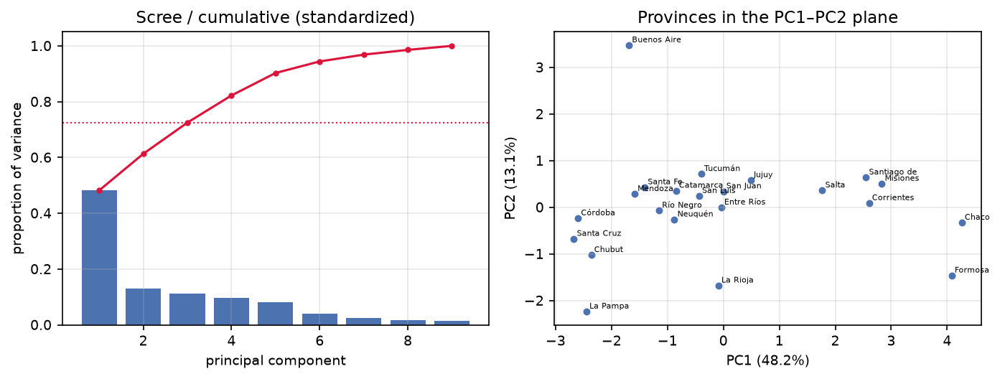

## 6.3 用前三个主成分回归

以 $PC_1,PC_2,PC_3$ 为自变量（主成分得分）拟合 $gdp$：

| 项 | 系数 | 标准误 | t 值 | p 值 |
| --- | --- | --- | --- | --- |
| 截距 | 3.056e+07 | 7.92e+06 | 3.859 | 0.0011 |
| PC1 | -8.661e+06 | 3.80e+06 | -2.278 | 0.0350 |
| PC2 | 3.905e+07 | 7.29e+06 | 5.360 | 0.0001 |
| PC3 | 1.981e+07 | 7.90e+06 | 2.509 | 0.0216 |

$R^{2}=0.6908$，$R^{2}_{adj}=0.6393$，$F=13.40$（$p=7.7\times10^{-5}$），RSS $=2.482\times10^{16}$。
三个主成分方向都在 $5\%$ 水平上显著：PC1 的负号说明“社会经济不利程度越高、$gdp$ 越低”，
PC2 的正号说明人口规模大（且文娱设施密度低）的省份 $gdp$ 更高。等价地写成标准化 $x$ 的系数
$\hat\beta_x=V\hat\beta_{PC}$（$V$ 为载荷矩阵）：

| 变量 | 标准化尺度系数 |
| --- | --- |
| illiteracy | -8.1e+05 |
| poverty | -5.3e+06 |
| deficient_infra | -1.8e+07 |
| school_dropout | 7.2e+06 |
| no_healthcare | 1.9e+06 |
| birth_mortal | -8.6e+06 |
| pop | 3.4e+07 |
| movie_theatres_per_cap | -1.6e+07 |
| doctors_per_cap | 1.1e+07 |

**注记**：前三个主成分只有 3 个自由度，却已经拿到 $R^{2}=0.69$；作为对照，
用全部 9 个标准化变量做 OLS 得 $R^{2}=0.99396$ —— 说明 $gdp$ 的变异还有相当一部分落在
被丢弃的 6 个“小方差方向”上。这正是 PCA 回归的典型取舍：**用 3 个自由度换取 $72.5\%$ 的自变量方差解释**，
适合预测/降维，但会遗漏个别变量特有的解释力（例如 `pop` 的方向只有 13% 的方差）。

**稳健性对照**：把因变量换成 $\log(gdp)$（$gdp$ 右偏严重），$R^{2}$ 升到 $0.7129$（$R^{2}_{adj}=0.6651$）；
不用标准化直接做 PCA 回归 $R^{2}$ 可以到 $0.9906$，但这只是“量纲效应”而非真实结构，
不能作为变量选择的依据。

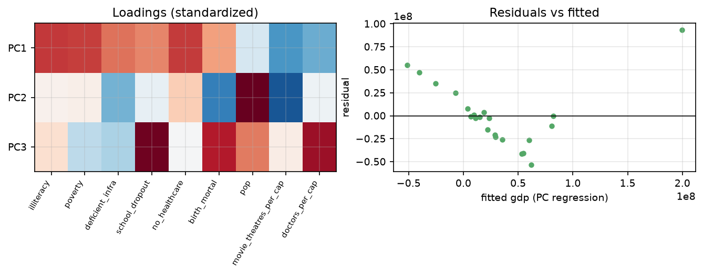

---

# Problem 7 (10 pts)：小费数据的模型选择

## 7.1 数据与水平数

`tip.csv`（题目中写作 tips.csv）是餐厅消费记录，$n=244$ 条。取 $Y=$ `tip`，
$A=$ `sex`（Male 157 / Female 87），$B=$ `smoker`（No 151 / Yes 93），
$C=$ `time`（Dinner 176 / Lunch 68）。三个自变量都是二分类变量，水平数各为 2；
`day`（星期几）本题不使用。

七个候选模型（参数个数 $k$ 含截距）与最小二乘拟合结果：

| 模型 | k | RSS | R² | R²adj | AIC | BIC | ΔAIC | ΔBIC |
| --- | --- | --- | --- | --- | --- | --- | --- | --- |
| M1: Y ~ 1 | 1 | 465.2125 | 0.0000 | 0.0000 | 159.46 | 162.96 | 0.00 | 0.00 |
| M2: Y ~ A+B+C | 4 | 456.3472 | 0.0191 | 0.0068 | 160.76 | 174.75 | 1.31 | 11.80 |
| M3: Y ~ A+B+C+A:B | 5 | 455.9913 | 0.0198 | 0.0034 | 162.57 | 180.06 | 3.12 | 17.10 |
| M4: Y ~ A+B+C+B:C | 5 | 455.9508 | 0.0199 | 0.0035 | 162.55 | 180.04 | 3.09 | 17.08 |
| M5: Y ~ A+B+C+A:C | 5 | 456.0608 | 0.0197 | 0.0033 | 162.61 | 180.10 | 3.15 | 17.14 |
| M6: Y ~ A+B+C+A:B+B:C+A:C | 7 | 455.4913 | 0.0209 | -0.0039 | 166.31 | 190.79 | 6.85 | 27.83 |
| M7: Y ~ A+B+C+A:B+B:C+A:C+A:B:C | 8 | 454.4032 | 0.0232 | -0.0057 | 167.72 | 195.70 | 8.26 | 32.74 |

其中 AIC 与 BIC 按常用的（相差一个常数不影响排序的）形式计算：

$$
\text{AIC}=n\log\frac{RSS}{n}+2k,\qquad \text{BIC}=n\log\frac{RSS}{n}+k\log n .
$$

M7 是“2×2×2 单元均值”饱和模型：它的最小二乘解就是 8 个单元各自的样本均值，
故 RSS 等于组内平方和（数值校核：$454.4032$ 与 $454.4032$，差 $1.1\times10^{-13}$）。
八个单元的小费均值（括号内为样本数）见下表，可作为数据面貌的直观参考：

| sex | smoker | time | 均值 | 个数 |
| --- | --- | --- | --- | --- |
| Female | No | Dinner | 3.044 | 29 |
| Female | No | Lunch | 2.460 | 25 |
| Female | Yes | Dinner | 2.949 | 23 |
| Female | Yes | Lunch | 2.891 | 10 |
| Male | No | Dinner | 3.158 | 77 |
| Male | No | Lunch | 2.942 | 20 |
| Male | Yes | Dinner | 3.123 | 47 |
| Male | Yes | Lunch | 2.791 | 13 |

## 7.2 三个准则选出的最佳模型

- $R^{2}_{adj}$ 最大：**M2（$Y\sim A+B+C$）**，$R^2_{adj}=0.0068$；
- AIC 最小：**M1（只有截距）**，$AIC=159.46$；
- BIC 最小：**M1（只有截距）**，$BIC=162.96$。

**为什么结论不同？** 三个准则的惩罚力度不同：

$$
R^{2}_{adj}=1-(1-R^{2})\frac{n-1}{n-k},\qquad
\text{AIC penalty}=2k,\qquad \text{BIC penalty}=k\log n\ (\approx 5.5k).
$$

在这个数据里，从 M1 到 M2 增加 3 个参数只把 RSS 从 $465.21$ 降到 $456.35$（降低 $1.9\%$），
换来的“信息量”很小：$R^2_{adj}$ 的惩罚较轻（该样本下 $\approx 1.2k$），于是 M2 略胜；
而 AIC 的 $2k$ 与 BIC 的 $5.5k$ 都超过了这点收益，于是宁可选择最简单的 M1。
从 M2 再往上加交互项，RSS 几乎不再下降（<0.2%），因此任何准则都不支持 M3–M7，
它们连 $R^{2}_{adj}$ 都变成了负数（说明这些参数完全是噪声）。

**显著性检验（同一结论）**：嵌套模型的 $F$ 检验

| 比较 | F | df | p 值 |
| --- | --- | --- | --- |
| M1 → M2 | 1.554 | 3, 240 | 0.201 |
| M2 → M3 | 0.187 | 1, 239 | 0.666 |
| M2 → M6 | 0.149 | 3, 237 | 0.931 |
| M6 → M7 | 0.565 | 1, 236 | 0.453 |

所有 $p$ 值都大于 $0.2$：**没有证据表明小费金额依赖于性别、是否吸烟或用餐时段**。
这与经典结论一致：《统计学习基础》中著名的 `tips` 例子（Hastie 等，图 3.7）里，
真正对小费有解释力的是 `total_bill`，而本题的候选变量里没有它，
所以“最好的模型”退化为只有截距也不奇怪。

**结论表述**：若按题目要求分别回答，则 $R^{2}_{adj}$ 准则的最佳模型是 M2（$Y\sim A+B+C$），
AIC 与 BIC 准则的最佳模型是 M1（$Y\sim 1$）。考虑到 F 检验不显著、$R^{2}_{adj}$ 只有 $0.7\%$，
我们倾向于认为 M1 更可信，即 A/B/C 三个因子对 tip 没有实际影响。

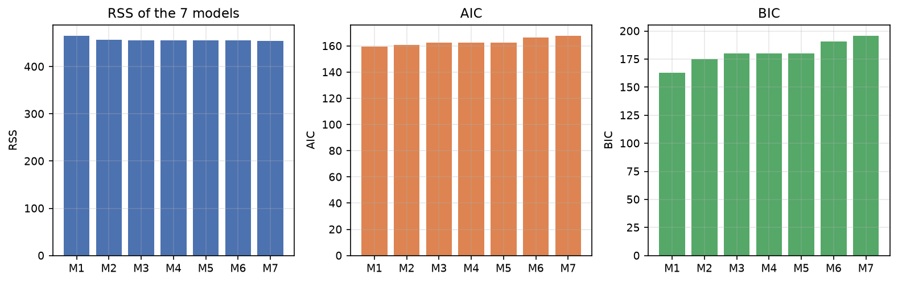

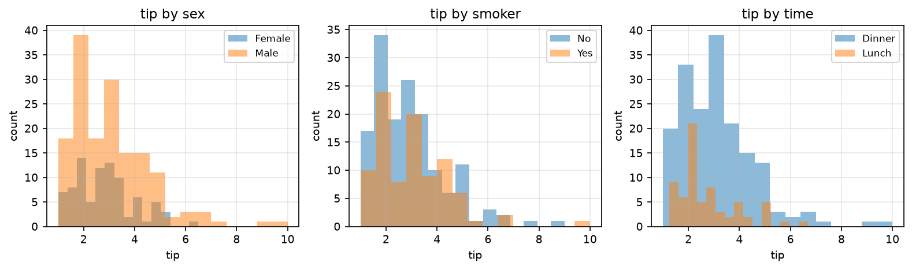

---

# Problem 8 (15 pts)：学生表现数据的三种子集选择方法

## 8.1 数据说明与预处理

`Student_Performance.csv`：因变量 $Y=$ `Performance Index`。题目说明数据集含 1000 条记录，
但实际文件有 **10000** 行（可能是题目笔误，以下按实际的 $n=10000$ 计算）。
候选自变量 5 个：`Hours Studied`（HS）、`Previous Scores`（PS）、
`Extracurricular Activities`（EA，转成哑变量：Yes=1, No=0）、`Sleep Hours`（SH）、
`Sample Question Papers Practiced`（SQ）。

选择准则取 **AIC**（同时给出 BIC 与 $p$ 值准则作为对照，以说明结论不依赖具体准则）。
方法：FS（forward selection，从空模型逐步加入使准则下降最多的变量）、
BE（backward elimination，从全模型逐步剔除使准则下降最多的变量）、
FS+BE（stepwise，每步先尝试加、再尝试删，直到不再改进）。
为了检查贪心算法是否真的找到全局最优，还做了 $2^{5}=32$ 个全子集穷举。

## 8.2 结果

| 准则 | 方法 | 选中的变量 | k | RSS | R² | R²adj | AIC | BIC |
| --- | --- | --- | --- | --- | --- | --- | --- | --- |
| AIC | FS | PS+HS+SH+SQ+EA | 6 | 41513.51 | 0.9888 | 0.9887 | 14246.34 | 14289.60 |
| AIC | BE | HS+PS+EA+SH+SQ | 6 | 41513.51 | 0.9888 | 0.9887 | 14246.34 | 14289.60 |
| AIC | FS+BE | PS+HS+SH+SQ+EA | 6 | 41513.51 | 0.9888 | 0.9887 | 14246.34 | 14289.60 |
| BIC | FS / BE / FS+BE | 同上（5 个变量全选） | 6 | 41513.51 | 0.9888 | 0.9887 | 14246.34 | 14289.60 |

三种方法的选择路径（AIC 准则，括号内为该步骤后的 AIC）：

- FS：加入 PS（40939.13）→ HS（16520.02）→ SH（15177.47）→ SQ（14467.83）→ EA（14246.34），随后停止；
- BE：从全模型出发，删除任一变量都会使 AIC 变大，故直接停在全模型——即**全模型被选中**（与 FS 的终点一致）；
- FS+BE：路径与 FS 相同，且每步未发现可删的变量，故与 FS 结论一致。

**全子集穷举**：32 个模型里 AIC 与 BIC 的最小值都在 $\{HS,PS,EA,SH,SQ\}$ 处取得，
与三种贪心方法一致；$p$ 值准则（$\alpha=0.05$ 逐步）同样保留全部 5 个变量。
因此本题的结论非常稳健：**没有变量需要被剔除**。

## 8.3 最终模型与解释

最终模型（等价于全模型）$\hat Y=\hat\beta_0+\hat\beta_1 HS+\hat\beta_2 PS+\hat\beta_3 SH+\hat\beta_4 SQ+\hat\beta_5 EA$：

| 项 | 系数 | 标准误 | t 值 | p 值 | 95% 置信区间 |
| --- | --- | --- | --- | --- | --- |
| 截距 | -34.076 | 0.127 | -268.0 | <1e-300 | [-34.325, -33.826] |
| PS | 1.0184 | 0.0012 | 866.5 | <1e-300 | [1.0161, 1.0207] |
| HS | 2.8530 | 0.0079 | 362.4 | <1e-300 | [2.8375, 2.8684] |
| SH | 0.4806 | 0.0120 | 40.0 | <1e-300 | [0.4570, 0.5041] |
| SQ | 0.1938 | 0.0071 | 27.3 | <1e-300 | [0.1799, 0.2077] |
| EA | 0.6129 | 0.0408 | 15.0 | 1.7e-50 | [0.5330, 0.6928] |

$R^{2}=0.9888$，$R^{2}_{adj}=0.9887$，LOOCV $=4.1564$。
解释：在其他条件不变时，多做 1 小时学习提高 2.85 分，往年成绩每高 1 分提高 1.02 分，
多睡 1 小时提高 0.48 分，多做 1 套样题提高 0.19 分，参加课外活动提高 0.61 分。

**为什么“弱变量”也被保留？** 单变量回归的 $R^{2}$ 与最终模型的显著性形成鲜明对照：

| 变量 | 单变量 R² | 单变量 AIC | 最终模型中 p 值 | 最终模型系数 |
| --- | --- | --- | --- | --- |
| PS | 0.8376 | 40939 | <1e-300 | 1.0184 |
| HS | 0.1397 | 57610 | <1e-300 | 2.8530 |
| SH | 0.0023 | 59091 | <1e-300 | 0.4806 |
| SQ | 0.0019 | 59096 | 7.5e-158 | 0.1938 |
| EA | 0.0006 | 59108 | 1.7e-50 | 0.6129 |

SH、SQ、EA 单独看几乎没有解释力（$R^{2}\leq0.003$），但在 5 个自变量近似正交
（两两相关系数 $|r|<0.02$）且 $n=10^{4}$ 时，它们每一个的微小效应都能被精确估计出来，
因此 AIC/BIC（以 $\log RSS$ 的信息量衡量）和 $t$ 检验都会把它们留在模型里。
这提醒我们：**“统计显著”不等于“实际重要”**（effect size），
在报告模型时应该同时给出系数大小与 $R^{2}$ 的边际增量。另外，AIC 准则下去掉 SH、SQ、EA
任意一个，$\Delta$AIC 都小于 4，说明这些变量的取舍对预测影响很小——
这也是模型选择本身存在不确定性的体现。

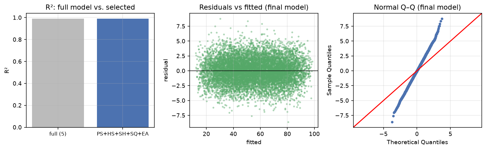

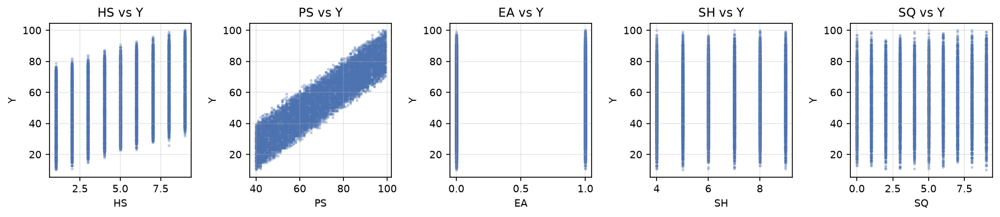

---

# 附录

## A. 文件清单

| 文件 | 内容 |
| --- | --- |
| `code/common.py` | 公共工具：数据读取、OLS 计算（含 AIC/BIC/LOOCV）、输出格式化 |
| `code/p1_p4_verify.py` | 题 1–4 的数值校核（恒等式、Monte Carlo、方差膨胀） |
| `code/p5_power.py` | 题 5：四次拟合、结点选择、GCV 平滑样条与图 |
| `code/p6_argentina.py` | 题 6：标准化 PCA、主成分回归、系数回换算 |
| `code/p7_tips.py` | 题 7：7 个模型的 RSS/AIC/BIC 与嵌套 F 检验 |
| `code/p8_student.py` | 题 8：FS/BE/FS+BE、全子集穷举、诊断图 |
| `code/run_all.sh` | 一键复现全部结果 |
| `data/*.csv` | 题目数据（来自 hw1-2023-data.zip） |
| `results/*.csv, *.md, *.json` | 全部数值结果与表格 |
| `figures/*.png` | 全部插图 |

## B. 复现方式与环境

```
cd code && bash run_all.sh          # 约 30 秒
```

使用的软件：Python 3.11，numpy 2.4、pandas 3.0、scipy 1.17、scikit-learn 1.9、
statsmodels 0.15、matplotlib 3.11。所有随机模拟都固定了随机种子
（`numpy.random.default_rng(20261008)`）。

## C. 常用公式汇总

$$
\text{AIC}=n\log\frac{RSS}{n}+2k,\qquad
\text{BIC}=n\log\frac{RSS}{n}+k\log n,\qquad
\text{LOOCV}=\frac{1}{n}\sum_i\left(\frac{e_i}{1-h_{ii}}\right)^{2},\qquad
R^{2}_{adj}=1-\frac{RSS/(n-k)}{TSS/(n-1)} .
$$
